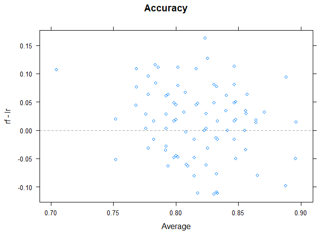

# Cargar y verificar los datos
Primero de todo, cargamos los paquetes que vamos a usar.

```r
library(lattice)
library(ggplot2)
library(caret)
```

Y después, leemos el dataset.

```r
titanic <- read.csv("./train.csv", stringsAsFactors = FALSE, na.strings = c("NA", ""))
str(titanic)
```

```
## 'data.frame':	891 obs. of  12 variables:
##  $ PassengerId: int  1 2 3 4 5 6 7 8 9 10 ...
##  $ Survived   : int  0 1 1 1 0 0 0 0 1 1 ...
##  $ Pclass     : int  3 1 3 1 3 3 1 3 3 2 ...
##  $ Name       : chr  "Braund, Mr. Owen Harris" "Cumings, Mrs. John Bradley (Florence Briggs Thayer)" "Heikkinen, Miss. Laina" "Futrelle, Mrs. Jacques Heath (Lily May Peel)" ...
##  $ Sex        : chr  "male" "female" "female" "female" ...
##  $ Age        : num  22 38 26 35 35 NA 54 2 27 14 ...
##  $ SibSp      : int  1 1 0 1 0 0 0 3 0 1 ...
##  $ Parch      : int  0 0 0 0 0 0 0 1 2 0 ...
##  $ Ticket     : chr  "A/5 21171" "PC 17599" "STON/O2. 3101282" "113803" ...
##  $ Fare       : num  7.25 71.28 7.92 53.1 8.05 ...
##  $ Cabin      : chr  NA "C85" NA "C123" ...
##  $ Embarked   : chr  "S" "C" "S" "S" ...
```
Nuestra base de datos tiene informaci?n sobre 12 variables diferentes de 891 pasajaeros del Titanic.

| Variable Name | Description                       |
| ------------- | --------------------------------- |
| Survived      | Survived (1) or died (0)          |
| Pclass        | Passenger's class                 |
| Name          | Passenger's name                  |
| Sex           | Passenger's sex                   |
| Age           | Passenger's age                   |
| SibSp         | Number of siblings/spouses aboard |
| Parch         | Number of parents/children aboard |
| Ticket        | Ticket number                     |
| Fare          | Fare                              |
| Cabin         | Cabin                             |
| Embarked      | Port of embarkation               |


# Preprocesamiento
Antes de empezar a trabajar con nuestra base de datos hay que observar como es esta.

Estudiamos cuantos valores unicos hay en cada variable.

```r
lapply(titanic, function(x) length(unique(x)))
```

```
## $PassengerId
## [1] 891
## 
## $Survived
## [1] 2
## 
## $Pclass
## [1] 3
## 
## $Name
## [1] 891
## 
## $Sex
## [1] 2
## 
## $Age
## [1] 89
## 
## $SibSp
## [1] 7
## 
## $Parch
## [1] 7
## 
## $Ticket
## [1] 681
## 
## $Fare
## [1] 248
## 
## $Cabin
## [1] 148
## 
## $Embarked
## [1] 4
```
La variable categórica *"PassengerId"* tiene un valor diferente para cada pasajero y en pricipio la descartamos porque no nos aporta ninguna información (habría que preguntar como se creo esa variable para saber si puede contener alguna información). Vamos a hacer lo mismo con la variable categórica *"Ticket"* porque tiene 681 valores diferentes. Con *"Name"* no lo vamos a hacer todavía porque podemos extraer información.

```r
titanic <- subset(titanic, select = -c(PassengerId, Ticket))
```

Estudiamos también, cuantos valores perdidos hay en cada variable.

```r
sapply(titanic, function(x) sum(is.na(x)))
```

```
## Survived   Pclass     Name      Sex      Age    SibSp    Parch     Fare 
##        0        0        0        0      177        0        0        0 
##    Cabin Embarked 
##      687        2
```

Vamos a quitar la variable *"Cabin"* porque tiene muchos valores perdidos y no sabemos como se podrían imputar.

```r
titanic <- subset(titanic, select = -c(Cabin))
```


## Extraer información de *Name* y crear la nueva variable *"Title"*

```r
# Extraer el t?tulo del nombre
titanic$Title <- gsub('(.*, )|(\\..*)', '', titanic$Name)

# Contar personas en cada categor?a de t?tulo por sexo
table(titanic$Sex, titanic$Title)
```

```
##         
##          Capt Col Don  Dr Jonkheer Lady Major Master Miss Mlle Mme  Mr Mrs
##   female    0   0   0   1        0    1     0      0  182    2   1   0 125
##   male      1   2   1   6        1    0     2     40    0    0   0 517   0
##         
##           Ms Rev Sir the Countess
##   female   1   0   0            1
##   male     0   6   1            0
```

```r
# Juntamos los t?tulos poco frecuentes en la categor?a "rare"
rare_title <- c('Dona', 'Lady', 'the Countess','Capt', 'Col', 'Don', 
                'Dr', 'Major', 'Rev', 'Sir', 'Jonkheer')

# Tambi?n, recodificamos mlle, ms, and mme.
titanic$Title[titanic$Title == 'Mlle']        <- 'Miss' 
titanic$Title[titanic$Title == 'Ms']          <- 'Miss'
titanic$Title[titanic$Title == 'Mme']         <- 'Mrs' 
titanic$Title[titanic$Title %in% rare_title]  <- 'Rare Title'

titanic$Title <- as.factor(titanic$Title)
table(titanic$Sex, titanic$Title)
```

```
##         
##          Master Miss  Mr Mrs Rare Title
##   female      0  185   0 126          3
##   male       40    0 517   0         20
```

Ya hemos extraido información de la variable *"Name"* y no nos hace falta más.

```r
titanic <- subset(titanic, select = -c(Name))
```

## Imputar valores perdidos de *"Age"*
Vamos a imputar los valores perdidos en la variable *"Age"* usando la mediana en *"Age"* dependiendo de *"Title"*.

```r
titanic$Age[which(titanic$Title=="Master" & is.na(titanic$Age))] <- 
  median(titanic$Age[which(titanic$Title=="Master")], na.rm = TRUE)
titanic$Age[which(titanic$Title=="Miss" & is.na(titanic$Age))] <- 
  median(titanic$Age[which(titanic$Title=="Miss")], na.rm = TRUE)
titanic$Age[which(titanic$Title=="Mr" & is.na(titanic$Age))] <- 
  median(titanic$Age[which(titanic$Title=="Mr")], na.rm = TRUE)
titanic$Age[which(titanic$Title=="Mrs" & is.na(titanic$Age))] <- 
  median(titanic$Age[which(titanic$Title=="Mrs")], na.rm = TRUE)
titanic$Age[which(titanic$Title=="Rare Title" & is.na(titanic$Age))] <- 
  median(titanic$Age[which(titanic$Title=="Rare Title")], na.rm = TRUE)
sum(is.na(titanic$Age))
```

```
## [1] 0
```

## Imputar valores perdidos en *"Embarked"*
Hay dos valores perdidos en la variable *"Embarked"*.

```r
table(titanic$Embarked)
```

```
## 
##   C   Q   S 
## 168  77 644
```

Vamos a inferir estos dos valores usando la información de las variables *"Fare"* y *"Pclass"*, que puede que sea la más relevante.

```r
(indexes <- which(is.na(titanic$Embarked)))
```

```
## [1]  62 830
```

```r
titanic$Fare[indexes]
```

```
## [1] 80 80
```

```r
titanic$Pclass[indexes]
```

```
## [1] 1 1
```
Como podemos observar, los dos pasajeros con valor perdido en la variable *"Embarked"* son de la *"Pclass"* 1 y tienen el valor de *"Fare"* 80.

```r
primera <- titanic[which(titanic$Pclass==1),]
boxplot(primera$Fare~primera$Embarked, col="lightseagreen", ylab="Fare", xlab="Embarked")
title(main = "Fare dependiendo de Embarked para los pasajeros de Pclass=1")
abline(h=80, col="red")
```

<!-- -->
Como podemos ver, el valor que mejor se ajusta es "C". Por lo tanto,

```r
titanic$Embarked[indexes] <- "C"
titanic$Embarked <- factor(titanic$Embarked)
sum(is.na(titanic$Embarked))
```

```
## [1] 0
```

## Creamos algunas nuevas variables más
### La nueva variable *"FSize"*
Vamos a crear una variable que nos dija el tamaño de la familia de cada pasajero, incluyendo en ese valor al pasajero.

```r
titanic$Fsize <- titanic$SibSp + titanic$Parch + 1
```

### La nueva variable *"Child"*
Esta variable nos indicará si el pasajero es un niño o un adulto.

```r
titanic$Child[titanic$Age < 18] <- 'Child'
titanic$Child[titanic$Age >= 18] <- 'Adult'
titanic$Child  <- factor(titanic$Child)
```

### La nueva variable *"Mother"*
Esta variable nos indicará si la pasajera es madre o no.

```r
titanic$Mother <- 'Not Mother'
titanic$Mother[titanic$Sex == 'female' & titanic$Parch > 0 & 
                 titanic$Age > 18 & titanic$Title != 'Miss'] <- 'Mother'
titanic$Mother <- factor(titanic$Mother)
```

# Análisis descriptivo


```r
titanic$Survived <- factor(titanic$Survived, levels=c(0,1))
levels(titanic$Survived) <- c("Died", "Survived")
titanic$Pclass <- as.factor(titanic$Pclass)
levels(titanic$Pclass) <- c("1st Class", "2nd Class", "3rd Class")
titanic$Sex <- as.factor(titanic$Sex)
str(titanic)
```

```
## 'data.frame':	891 obs. of  12 variables:
##  $ Survived: Factor w/ 2 levels "Died","Survived": 1 2 2 2 1 1 1 1 2 2 ...
##  $ Pclass  : Factor w/ 3 levels "1st Class","2nd Class",..: 3 1 3 1 3 3 1 3 3 2 ...
##  $ Sex     : Factor w/ 2 levels "female","male": 2 1 1 1 2 2 2 2 1 1 ...
##  $ Age     : num  22 38 26 35 35 30 54 2 27 14 ...
##  $ SibSp   : int  1 1 0 1 0 0 0 3 0 1 ...
##  $ Parch   : int  0 0 0 0 0 0 0 1 2 0 ...
##  $ Fare    : num  7.25 71.28 7.92 53.1 8.05 ...
##  $ Embarked: Factor w/ 3 levels "C","Q","S": 3 1 3 3 3 2 3 3 3 1 ...
##  $ Title   : Factor w/ 5 levels "Master","Miss",..: 3 4 2 4 3 3 3 1 4 4 ...
##  $ Fsize   : num  2 2 1 2 1 1 1 5 3 2 ...
##  $ Child   : Factor w/ 2 levels "Adult","Child": 1 1 1 1 1 1 1 2 1 2 ...
##  $ Mother  : Factor w/ 2 levels "Mother","Not Mother": 2 2 2 2 2 2 2 2 1 2 ...
```


```r
for (i in (1:dim(titanic)[2])[-c(4,7)]) {
  print(names(titanic)[i])
  print(table(titanic[,i]))
  cat(round(prop.table(table(titanic[,i])),3),"\n\n")
}
```

```
## [1] "Survived"
## 
##     Died Survived 
##      549      342 
## 0.616 0.384 
## 
## [1] "Pclass"
## 
## 1st Class 2nd Class 3rd Class 
##       216       184       491 
## 0.242 0.207 0.551 
## 
## [1] "Sex"
## 
## female   male 
##    314    577 
## 0.352 0.648 
## 
## [1] "SibSp"
## 
##   0   1   2   3   4   5   8 
## 608 209  28  16  18   5   7 
## 0.682 0.235 0.031 0.018 0.02 0.006 0.008 
## 
## [1] "Parch"
## 
##   0   1   2   3   4   5   6 
## 678 118  80   5   4   5   1 
## 0.761 0.132 0.09 0.006 0.004 0.006 0.001 
## 
## [1] "Embarked"
## 
##   C   Q   S 
## 170  77 644 
## 0.191 0.086 0.723 
## 
## [1] "Title"
## 
##     Master       Miss         Mr        Mrs Rare Title 
##         40        185        517        126         23 
## 0.045 0.208 0.58 0.141 0.026 
## 
## [1] "Fsize"
## 
##   1   2   3   4   5   6   7   8  11 
## 537 161 102  29  15  22  12   6   7 
## 0.603 0.181 0.114 0.033 0.017 0.025 0.013 0.007 0.008 
## 
## [1] "Child"
## 
## Adult Child 
##   774   117 
## 0.869 0.131 
## 
## [1] "Mother"
## 
##     Mother Not Mother 
##         55        836 
## 0.062 0.938
```

Para las variables *Age* y *Fare* vamos a dibujar el histograma y la diagrama de cajas que nos dan información de una forma más visual.

```r
par(mfrow=c(1,2))
hist(titanic$Age, main='Age', ylab='Frecuencias', xlab='Edad', col='lightseagreen')
boxplot(titanic$Age, main='Age', ylab='Edad', col='lightseagreen')
```

<!-- -->

```r
hist(titanic$Fare, main='Fare', ylab='Frecuencias', xlab='Tarifa', col='lightseagreen')
boxplot(titanic$Fare, main='Fare', ylab='Tarifa', col='lightseagreen')
```

<!-- -->

```r
par(mfrow=c(1,1))
```


# Creación de los modelos con el paquete Caret
Antes de aprender un modelo de clasificación es necesario definir las instancias de entrenamiento y test, que darán forma a nuestro modelado. Hay tres opciones de para definir estas instancias.

```r
?createDataPartition
```

```
## starting httpd help server ... done
```

```r
# A series of test/training partitions are created using createDataPartition while createResample creates one or more bootstrap samples. createFolds splits the data into k groups while createTimeSlices creates cross-validation split for series data. groupKFold splits the data based on a grouping factor.
```

Creamos los conjuntos de *train* y *test* con la funci?n *createDataPartition* y la relación de porcentaje de conjunto de datos para cada conjunto sera 70/30.

(Fijamos una semilla para futuras generaciones de numeros aleatorios)

```r
set.seed(107)
inTrain <- createDataPartition(y=titanic$Survived,p=.7,list=FALSE)
training <- titanic[inTrain,]
testing <- titanic[-inTrain,]
```

Usaremos *repeated K-fold cross-validation*.

```r
fitControl <- trainControl(## 10-fold CV
                           method = "repeatedcv",
                           number = 10,
                           ## repeated ten times
                           repeats = 10)
```

## Random Forest
For random forests since one feature is never compared in magnitude to other features, the ranges don't matter. It's only the range of one feature that is split at each stage.

```r
rf_Model10x10cv <- train(Survived ~ ., data=training, method="rf", trControl=fitControl, metric = "Accuracy")
rf_Model10x10cv
```

```
## Random Forest 
## 
## 625 samples
##  11 predictor
##   2 classes: 'Died', 'Survived' 
## 
## No pre-processing
## Resampling: Cross-Validated (10 fold, repeated 10 times) 
## Summary of sample sizes: 562, 563, 563, 562, 562, 563, ... 
## Resampling results across tuning parameters:
## 
##   mtry  Accuracy   Kappa    
##    2    0.8238684  0.6141430
##    9    0.8256426  0.6279045
##   16    0.8163415  0.6102431
## 
## Accuracy was used to select the optimal model using the largest value.
## The final value used for the model was mtry = 9.
```

Validación del modelo.

```r
rf_predicted <- predict(rf_Model10x10cv, testing)
confusionMatrix(rf_predicted, testing$Survived)
```

```
## Confusion Matrix and Statistics
## 
##           Reference
## Prediction Died Survived
##   Died      145       29
##   Survived   19       73
##                                          
##                Accuracy : 0.8195         
##                  95% CI : (0.768, 0.8638)
##     No Information Rate : 0.6165         
##     P-Value [Acc > NIR] : 5.675e-13      
##                                          
##                   Kappa : 0.6112         
##  Mcnemar's Test P-Value : 0.1939         
##                                          
##             Sensitivity : 0.8841         
##             Specificity : 0.7157         
##          Pos Pred Value : 0.8333         
##          Neg Pred Value : 0.7935         
##              Prevalence : 0.6165         
##          Detection Rate : 0.5451         
##    Detection Prevalence : 0.6541         
##       Balanced Accuracy : 0.7999         
##                                          
##        'Positive' Class : Died           
## 
```

Obtenemos en un gráfico cuales son las variables más importantes para clasificar a un pasajero como *"Died"*.

```r
plot(varImp(rf_Model10x10cv),main="Who's running our forest?", col="lightseagreen")
```

<!-- -->

## Logistic Regression

### Sin preprocesado
Si usamos el método de la regresión log?stica sin hacer ningún preprocesado antes, tenemos los siguiente.

```r
glm_Model10x10cv <- train(Survived ~ ., data=training, method="glm", trControl=fitControl, metric="Accuracy")
glm_Model10x10cv
```

```
## Generalized Linear Model 
## 
## 625 samples
##  11 predictor
##   2 classes: 'Died', 'Survived' 
## 
## No pre-processing
## Resampling: Cross-Validated (10 fold, repeated 10 times) 
## Summary of sample sizes: 562, 563, 562, 562, 562, 563, ... 
## Resampling results:
## 
##   Accuracy   Kappa    
##   0.8205197  0.6178906
```
Como podemos ver, R nos da una advertencia donde dice *prediction from a rank-deficient fit may be misleading*. Esto ocurre porque tenemos que quitar variables predictoras, ya que el rango de la matriz es mas baja que la cantidad de variables predictoras que hemos metido. Es decir, hay variables que son combinaciones lineales de otras.

### Quitando variables linealmente dependientes
Si estudiamos y quitamos estas variables (*"FSize"* que es combinaci?n de *"SibSp"* y *"Parch"*; y *"Sex"* que est? muy relacionada con *"Title"*) y hacemos de nuevo el training:

```r
glm_Model10x10cv <- train(Survived ~ ., data=training[,-c(3,10)], method="glm", trControl=fitControl, metric="Accuracy")
glm_Model10x10cv
```

```
## Generalized Linear Model 
## 
## 625 samples
##   9 predictor
##   2 classes: 'Died', 'Survived' 
## 
## No pre-processing
## Resampling: Cross-Validated (10 fold, repeated 10 times) 
## Summary of sample sizes: 562, 562, 562, 563, 563, 562, ... 
## Resampling results:
## 
##   Accuracy   Kappa    
##   0.8136482  0.6047914
```


```r
glm_predicted <- predict(glm_Model10x10cv, testing[,-c(10)])
confusionMatrix(glm_predicted, testing$Survived)
```

```
## Confusion Matrix and Statistics
## 
##           Reference
## Prediction Died Survived
##   Died      147       26
##   Survived   17       76
##                                           
##                Accuracy : 0.8383          
##                  95% CI : (0.7885, 0.8805)
##     No Information Rate : 0.6165          
##     P-Value [Acc > NIR] : 2.231e-15       
##                                           
##                   Kappa : 0.6523          
##  Mcnemar's Test P-Value : 0.2225          
##                                           
##             Sensitivity : 0.8963          
##             Specificity : 0.7451          
##          Pos Pred Value : 0.8497          
##          Neg Pred Value : 0.8172          
##              Prevalence : 0.6165          
##          Detection Rate : 0.5526          
##    Detection Prevalence : 0.6504          
##       Balanced Accuracy : 0.8207          
##                                           
##        'Positive' Class : Died            
## 
```

### Haciendo PCA

```r
preProc <- preProcess(training,method="pca",pcaComp=2)
trainingPCA <- predict(preProc,training)
glm_PCA_Model10x10cv <- train(Survived ~ ., data=trainingPCA[,-c(3)], method="glm", trControl=fitControl, metric="Accuracy")
glm_PCA_Model10x10cv
```

```
## Generalized Linear Model 
## 
## 625 samples
##   7 predictor
##   2 classes: 'Died', 'Survived' 
## 
## No pre-processing
## Resampling: Cross-Validated (10 fold, repeated 10 times) 
## Summary of sample sizes: 562, 563, 563, 562, 563, 562, ... 
## Resampling results:
## 
##   Accuracy   Kappa    
##   0.8109063  0.5973806
```


```r
testingPCA <- predict(preProc,testing)
glm_PCA_predicted <- predict(glm_PCA_Model10x10cv, testingPCA[,-c(3)])
confusionMatrix(glm_PCA_predicted, testing$Survived)
```

```
## Confusion Matrix and Statistics
## 
##           Reference
## Prediction Died Survived
##   Died      144       27
##   Survived   20       75
##                                           
##                Accuracy : 0.8233          
##                  95% CI : (0.7721, 0.8672)
##     No Information Rate : 0.6165          
##     P-Value [Acc > NIR] : 1.974e-13       
##                                           
##                   Kappa : 0.6214          
##  Mcnemar's Test P-Value : 0.3815          
##                                           
##             Sensitivity : 0.8780          
##             Specificity : 0.7353          
##          Pos Pred Value : 0.8421          
##          Neg Pred Value : 0.7895          
##              Prevalence : 0.6165          
##          Detection Rate : 0.5414          
##    Detection Prevalence : 0.6429          
##       Balanced Accuracy : 0.8067          
##                                           
##        'Positive' Class : Died            
## 
```

## Comparativa
Ya que no hemos cambiado la semilla de aleatorización, las particiones (de casos de training) utilizadas en los procesos de "resampling"-validación de cada clasificador han sido las mismas: esto es, las "folds"-hojas del proceso de validación cruzada han sido las mismas en ambos clasificadores.

Por lo tanto, podemos crear gráficos intuitivos como Bland-Altman. Para ello, hemos utilizado la función *resamples* de R, el cual combina los resultados de dos modelos del mismo conjunto de datos (y, como añadido, podemos hacer un resumen numérico de los dos modelos y sus métricas de evaluación utilizando la función genérica de R *summary*). logramos el siguiente gráfico que compara las métricas de *accuracy*:

```r
resamps=resamples(list(rf=rf_Model10x10cv,lr=glm_PCA_Model10x10cv))
summary(resamps)
```

```
## 
## Call:
## summary.resamples(object = resamps)
## 
## Models: rf, lr 
## Number of resamples: 100 
## 
## Accuracy 
##         Min.   1st Qu.    Median      Mean   3rd Qu.      Max. NA's
## rf 0.7258065 0.7928187 0.8253968 0.8256426 0.8548387 0.9354839    0
## lr 0.6507937 0.7777778 0.8225806 0.8109063 0.8412698 0.9365079    0
## 
## Kappa 
##         Min.   1st Qu.    Median      Mean   3rd Qu.      Max. NA's
## rf 0.4085297 0.5561494 0.6327504 0.6279045 0.6924517 0.8640351    0
## lr 0.2350993 0.5340166 0.6080206 0.5973806 0.6579805 0.8653846    0
```

```r
xyplot(resamps,what="BlandAltman")
```

<!-- -->

```r
diffs<-diff(resamps)
summary(diffs)
```

```
## 
## Call:
## summary.diff.resamples(object = diffs)
## 
## p-value adjustment: bonferroni 
## Upper diagonal: estimates of the difference
## Lower diagonal: p-value for H0: difference = 0
## 
## Accuracy 
##    rf      lr     
## rf         0.01474
## lr 0.01564        
## 
## Kappa 
##    rf      lr     
## rf         0.03052
## lr 0.02077
```

Como vemos, con un nivel de significancia del 5%, se refuta la hipótesis de que los dos modelos no tengan diferencias.
